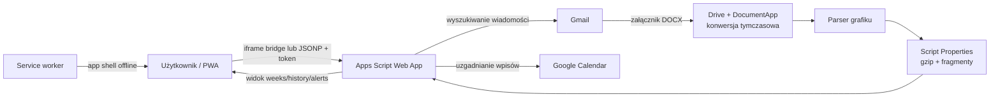

# Harmonogram MOW

PWA do pobierania grafików internatu z Gmaila, odczytu plików DOCX, prezentowania dyżurów wychowawców oraz synchronizacji wybranych wpisów z Kalendarzem Google. Frontend jest statyczną aplikacją HTML/CSS/JavaScript, a backend działa w Google Apps Script.

Aktualna wersja techniczna: **12.4.0**
Ostatni pełny audyt: **26 sierpnia 2026**
Repozytorium: [JarekDymek/Harmonogram-MOW](https://github.com/JarekDymek/Harmonogram-MOW)

## Co robi aplikacja

- pobiera z Gmaila załączniki DOCX wysłane przez skonfigurowanego nadawcę;
- rozpoznaje zwykłe grafiki internatu, grafiki wakacyjne i korekty;
- wybiera najlepszy dokument dla tygodnia i wskazanego wychowawcy;
- dzieli nocny dyżur przechodzący przez północ na właściwe części dwóch dni;
- pokazuje godziny, nadgodziny, pracę weekendową, zmiany i ostrzeżenia;
- przechowuje historię tygodni oraz listę wykrytych wychowawców;
- synchronizuje Kalendarz Google wyłącznie dla `CONFIG.calendarEducator`;
- po każdym uruchomieniu automatycznie pobiera dane, a z `ADMIN_TOKEN` także skanuje Gmail i uzgadnia Kalendarz;
- udostępnia na żądanie pełny plan całego internatu dla wybranego tygodnia w układzie dzień → grupa → dyżury;
- działa jako instalowalna PWA oraz udostępnia ostatnio zapisany widok offline;
- rozróżnia dostęp tylko do odczytu (`VIEW_TOKEN`) od administracyjnego (`ADMIN_TOKEN`).

## Architektura



### Główne komponenty

| Plik | Odpowiedzialność |
|---|---|
| `index.html` | Semantyczna struktura interfejsu i formularz ustawień |
| `assets/app.js` | Stan aplikacji, auto-synchronizacja, aktualizacje PWA, komunikacja z backendem i renderowanie |
| `assets/styles.css` | Responsywny układ telefonu, tabletu, desktopu i wydruku |
| `service-worker.js` | Precache app shell, tryb offline i izolacja cache tej aplikacji |
| `manifest.webmanifest` | Metadane instalacyjne PWA |
| `data/sample-weeks.json` | Dane demonstracyjne zgodne z aktualnym modelem nocnych dyżurów |
| `apps-script/Code.gs` | Web API, Gmail, DOCX, parser, pamięć i Calendar |
| `apps-script/ParserTests.gs` | Testy uruchamiane bezpośrednio w edytorze Apps Script |
| `apps-script/appsscript.json` | Strefa czasowa, zakresy OAuth i usługi zaawansowane |
| `run-tests.mjs` | Lokalne testy regresji bez zewnętrznych zależności |
| `package.json` | Wersja techniczna i polecenia walidacji |

## Najważniejsze zasady projektu

### Kalendarz jest przypisany do jednej osoby

Pole `educator` wybiera osobę oglądaną w PWA. Nie zmienia ono właściciela synchronizacji kalendarza. Zapis do Calendar zawsze korzysta z `CONFIG.calendarEducator` — domyślnie `Dymek`.

Synchronizacja jest idempotentna. Każdy dyżur ma stabilny znacznik `HARMONOGRAM_SHIFT`. Backend:

1. pobiera istniejące wpisy zarządzane przez aplikację;
2. dodaje brakujące wpisy;
3. aktualizuje zmienione opisy;
4. dopiero na końcu usuwa wpisy nieaktualne.

Dzięki temu cykliczne uruchomienie nie usuwa i nie tworzy ponownie wszystkich zdarzeń, a błąd wstawiania nie kasuje najpierw poprawnego kalendarza.

### Backend domyślnie blokuje dostęp

`CONFIG.securityMode` ma wartość `token`. Jeżeli tokeny nie zostały jeszcze utworzone, backend odmawia dostępu. Jawny tryb otwarty wymaga świadomej zmiany konfiguracji na `open` i nie jest zalecany.

- `VIEW_TOKEN` pozwala wywołać `ping` i `dashboard`;
- `ADMIN_TOKEN` pozwala także wykonać skanowanie i synchronizację;
- błędy web app nie zwracają klientowi stosu wywołań;
- frontend akceptuje tylko adres HTTPS w domenie `script.google.com`, kończący się na `/exec`;
- odpowiedź mostu iframe jest przyjmowana wyłącznie z utworzonego przez aplikację okna iframe.

Token jest przekazywany w adresie żądania, ponieważ Apps Script nie zapewnia tu zwykłego CORS dla statycznej PWA. Nie należy wklejać tokenów do wiadomości, zrzutów ekranu ani publicznych zgłoszeń.

### Pamięć Apps Script respektuje limit pojedynczej właściwości

Google Apps Script ogranicza pojedynczą wartość Script Properties do 9 KB i cały magazyn do 500 KB. Dokumenty i alerty są dlatego kompresowane gzipem, kodowane Base64 i zapisywane w fragmentach do 7800 bajtów. Manifest zapisu zawiera generację i sumę SHA-256.

Stare, bezpośrednie wartości JSON pozostają odczytywalne. Przy kolejnym zapisie danego tygodnia są automatycznie migrowane do nowego formatu. Aktualne limity należy sprawdzać w [oficjalnej tabeli limitów Apps Script](https://developers.google.com/apps-script/guides/services/quotas).

### Service worker nie dotyka innych aplikacji

Cache ma własny prefiks `harmonogram-mow-shell-`. Aktywacja usuwa tylko starsze cache tego projektu — nie usuwa cache innych PWA działających w tej samej domenie GitHub Pages.

Service worker:

- nie przechwytuje żądań do Apps Script ani innych domen;
- nie zapisuje URL zawierających tokeny;
- używa fallbacku HTML wyłącznie dla nawigacji;
- nie podstawia `index.html` jako CSS, JavaScript lub obraz;
- respektuje żądania `cache: "no-store"`;
- przechowuje tylko jawnie wskazane zasoby app shell.

### Menu, automatyczny start i cały internat

Górny pasek zawiera jeden przycisk **Ustawienia**. Rozwijane menu zachowuje ręczne akcje synchronizacji, podglądu, testu backendu, powiadomień i danych demonstracyjnych, a także pokazuje numer aktywnej wersji oraz przyciski instalacji i kontroli aktualizacji.

Po zimnym uruchomieniu aplikacja automatycznie:

- wywołuje `sync`, jeśli na urządzeniu zapisano `ADMIN_TOKEN`;
- wywołuje tylko `dashboard`, jeśli zapisano wyłącznie `VIEW_TOKEN`;
- nie łączy się z backendem, jeśli nie ma URL albo tokenu;
- ponawia odświeżenie po powrocie do aplikacji, gdy była w tle dłużej niż 5 minut.

Filtr **Cały internat** pobiera osobną akcją `internat` plan tylko dla aktualnie wybranego tygodnia. Odpowiedź jest chroniona co najmniej `VIEW_TOKEN` i zapisywana lokalnie jako cache danego tygodnia. Zwykły dashboard nie jest przez to powiększany ani spowalniany.

Widok pełnego planu ma dwa poziomy rozwijania:

1. dzień tygodnia;
2. grupa 1–8 albo wakacyjna A/B; nocne dyżury są zachowane w osobnej sekcji **Noc**.

Frontend przechowuje do ośmiu ostatnio pobranych pełnych tygodni. Automatyczna aktualizacja pulpitu nie kasuje tego cache. Backend przekazuje `sourceVersion`, dlatego konkretny tydzień jest pobierany ponownie dopiero wtedy, gdy zmieni się zestaw dokumentów źródłowych. Pierwsze uruchomienie po przejściu ze starszej wersji może jednorazowo odświeżyć pełny tydzień, aby nadać mu wersję źródła.

## Konfiguracja backendu

Najczęściej zmieniane pola znajdują się na początku `apps-script/Code.gs`.

| Pole | Domyślnie | Znaczenie |
|---|---:|---|
| `sourceEmail` | `harmonogram@example.com` | Nadawca wiadomości z grafikami; przed wdrożeniem wpisz właściwy adres |
| `defaultEducator` | `Dymek` | Początkowy widok w PWA |
| `calendarEducator` | `Dymek` | Jedyna osoba zapisywana do Calendar |
| `calendarId` | `primary` | Kalendarz docelowy |
| `baseWeeklyHours` | `24` | Podstawa do obliczania nadgodzin |
| `triggerMinutes` | `30` | Częstotliwość automatycznego skanowania |
| `scanQueryDays` | `45` | Zakres zapytania Gmail |
| `scanPastDays` / `scanFutureDays` | `21` / `35` | Okno tygodni przechowywanych i pokazywanych |
| `maxDocsPerWeek` | `5` | Liczba wersji dokumentu zachowana dla tygodnia |
| `securityMode` | `token` | Tryb ochrony web app |

Alias wybranego wychowawcy dodaje się w `CONFIG.aliases`. Alias powinien być możliwie jednoznaczny, ponieważ parser dopasowuje nazwę po normalizacji polskich znaków i odstępów.

## Uruchomienie lokalne

Projekt nie wymaga instalowania bibliotek.

```powershell
python -m http.server 4173
```

Następnie otwórz `http://127.0.0.1:4173/`. Nie otwieraj `index.html` bezpośrednio jako `file://`, ponieważ service worker i część funkcji PWA wymagają HTTP lub HTTPS.

### Testy

```powershell
npm test
npm run check
```

`npm test` uruchamia trzynaście zestawów kontroli:

1. poprawność JSON i składni JavaScript;
2. zgodność identyfikatorów HTML z odwołaniami w frontendzie;
3. daty lokalne, przedziały przez północ, URL i normalizację danych;
4. wymuszenie właściwego profilu Google w żądaniach Apps Script;
5. kontrolę pochodzenia i identyfikatora odpowiedzi mostu iframe;
6. grupowanie pełnego planu i zachowanie aktualnego cache;
7. testy parsera Apps Script, w tym przełom roku i nocne dyżury;
8. budowę pełnego planu internatu dla wszystkich wykrytych osób;
9. kompresję i dzielenie dużych danych zgodnie z limitem 9 KB;
10. domyślną blokadę backendu bez skonfigurowanych tokenów;
11. idempotentną i bezpiecznie uporządkowaną synchronizację Calendar;
12. pojedyncze menu, auto-synchronizację i spójność wersjonowanych zasobów 12.3;
13. izolację żądań i cache service workera.

Testy lokalne używają atrap usług Google. Nie zastępują testu wdrożonego Apps Script z prawdziwym kontem Gmail i Calendar.

## Wdrożenie Google Apps Script

### Pierwsze wdrożenie

1. Utwórz samodzielny projekt Apps Script.
2. Wklej zawartość:
   - `apps-script/Code.gs`,
   - `apps-script/ParserTests.gs`,
   - `apps-script/appsscript.json`.
3. W Google Cloud projektu włącz usługi zaawansowane:
   - Drive API v2,
   - Calendar API v3.
4. Sprawdź strefę czasową `Europe/Warsaw`.
5. Uruchom `runParserTests()`.
6. Uruchom `setupSecurityTokens()` i zapisz oba tokeny w bezpiecznym miejscu.
7. Uruchom `install()`. Funkcja usuwa stary trigger `scanAndSync`, tworzy jeden nowy i wykonuje pełne skanowanie.
8. Wdróż jako aplikację internetową:
   - **Wykonaj jako:** użytkownik wdrażający;
   - **Kto ma dostęp:** każdy.
9. Skopiuj adres kończący się na `/exec` do ustawień PWA.
10. Najpierw sprawdź `VIEW_TOKEN` przyciskiem „Test backendu”, a dopiero potem użyj `ADMIN_TOKEN` do synchronizacji.

Dostęp „każdy” jest wymagany technicznie dla PWA. Ochronę danych zapewniają tokeny aplikacji. Bez obu tokenów backend pozostaje zablokowany.

### Aktualizacja istniejącego backendu

1. Uruchom lokalne `npm run check`.
2. Podmień trzy pliki Apps Script.
3. Uruchom `runParserTests()`.
4. Wybierz **Wdróż → Zarządzaj wdrożeniami → Edytuj → Nowa wersja → Wdróż**.
5. Jeżeli zmieniła się logika parsera lub Calendar, uruchom `forceRescan()` albo jednorazowo `syncVisibleWeeksToCalendar_()`.
6. Sprawdź historię wykonań Apps Script pod kątem błędów i limitów.

Nie uruchamiaj `install()` przy każdej drobnej zmianie, jeżeli działający trigger już istnieje. Użyj go wtedy, gdy trzeba odtworzyć trigger.

## Wdrożenie GitHub Pages

1. Włącz Pages dla gałęzi publikacyjnej i katalogu głównego.
2. Opublikuj co najmniej:
   - `index.html`,
   - `assets/`,
   - `data/`,
   - `manifest.webmanifest`,
   - `service-worker.js`.
3. Po zmianie dowolnego pliku app shell zmień wersję `CACHE` w `service-worker.js`.
4. Ujednolić tę samą wersję w `package.json` i `CONFIG.backendVersion`.
5. Zmień również parametr `?v=` przy CSS i JavaScript w `index.html` oraz na liście `ASSETS` service workera.
6. Po publikacji otwórz aplikację online; od wersji 12.2 kontroler przeładowuje stronę po przejęciu nowego workera.
7. Sprawdź online oraz offline w narzędziach aplikacji przeglądarki.

Aktualny manifest używa osobnych, skalowalnych ikon SVG typu `any` i `maskable`. Chromium je obsługuje. Dla maksymalnej zgodności z iOS i starszymi instalatorami warto w kolejnym wydaniu dodać także rasteryzowane ikony PNG 192×192 i 512×512.

### Jak sprawdzić i wymusić aktualizację PWA

Numer uruchomionego frontendu jest zawsze widoczny po rozwinięciu **Ustawienia**. Dla tego wydania powinien wynosić `12.4.0`.

Na komputerze:

1. otwórz aplikację z dostępem do internetu;
2. rozwiń **Ustawienia** i wybierz **Sprawdź aktualizację**;
3. jeżeli nadal widać poprzednią wersję, zamknij wszystkie karty aplikacji i otwórz ją ponownie;
4. dopiero w ostateczności użyj **Wyczyść dane** — ta akcja usuwa także zapisany URL i tokeny.

Na telefonie lub w zainstalowanej PWA:

1. uruchom aplikację przy aktywnym internecie;
2. pozostaw ją otwartą przez kilka sekund, zamknij i uruchom ponownie;
3. sprawdź numer wersji w **Ustawieniach**;
4. gdy nadal jest stary, wybierz **Sprawdź aktualizację**; odinstalowanie jest potrzebne tylko wtedy, gdy systemowy WebView lub przeglądarka nie wymienia service workera.

Wydanie 12.2 używa wersjonowanych adresów `app.js` i `styles.css`. Dzięki temu stary service worker nie może podstawić kodu poprzedniej wersji pod nowy HTML.

## Migracja ze starszych wersji

### Frontend

Przy pierwszym starcie v12 aplikacja próbuje odczytać klucze `harmonogram-mow-state-v8`–`v11`. Po udanej migracji zapisuje aktualny stan i usuwa stare klucze. „Wyczyść dane” usuwa bieżący klucz, wszystkie znane klucze legacy oraz cache offline tylko tej aplikacji.

Klucz `harmonogram-mow-state-v12` jest wersją schematu danych, dlatego pozostaje wersjonowany mimo usunięcia numerów wersji z nazwy produktu i komentarzy CSS.

### Backend

Stare tablice JSON w `docs:YYYY-MM-DD` i `alerts` są nadal czytane. Pierwszy kolejny zapis konwertuje je do kompresowanych fragmentów. Przetworzone załączniki używają krótkich, haszowanych kluczy i znaczników czasowych; stare, bezterminowe znaczniki są usuwane i mogą spowodować jednorazowe ponowne przetworzenie wiadomości.

### Calendar

Pierwsza synchronizacja po aktualizacji zastępuje stare zdarzenia bez `HARMONOGRAM_SHIFT`. Nowe wpisy są dodawane przed usunięciem starych, więc chwilowy błąd API nie pozostawia pustego kalendarza. Następne przebiegi są bezoperacyjne, jeżeli grafik się nie zmienił.

## Diagnostyka

### „Backend musi być adresem HTTPS…”

Użyj URL wdrożenia podobnego do:

```text
https://script.google.com/macros/s/IDENTYFIKATOR/exec
```

Adres `/dev`, domena inna niż `script.google.com`, parametry zapytania i fragment `#...` nie są akceptowane.

### „Ochrona tokenem jest włączona, ale tokeny nie zostały skonfigurowane”

Uruchom w edytorze Apps Script `setupSecurityTokens()`, a następnie utwórz nową wersję wdrożenia. Nie zmieniaj `securityMode` na `open` jako obejścia.

### PWA pokazuje starą wersję

1. upewnij się, że zmieniono nazwę `CACHE`;
2. odśwież stronę dwa razy;
3. użyj przycisku „Wyczyść dane”, jeżeli można usunąć lokalny stan;
4. w ostateczności odinstaluj PWA i zainstaluj ją ponownie.

### „Most iframe i JSONP nie zwróciły danych”

Wydanie 12.3.2 naprawia również routing wielu kont Google. Bez parametru `authuser=0` zalogowana przeglądarka mogła samoczynnie zamienić adres wdrożenia na trasę `/u/1/`, która pokazywała stronę „Nie można odnaleźć strony” zamiast odpowiedzi backendu. Wszystkie żądania aplikacji wymuszają teraz profil właściciela wdrożenia.

Jeżeli komunikat nadal pojawia się na wersji 12.4.0:

1. otwórz link **Test backendu** i potwierdź, że pojawia się JSON z `ok:true` albo `ok:false`;
2. wyłącz dla tej strony blokadę skryptów, reklam, prywatny DNS lub filtr antywirusowy blokujący `script.google.com` i `googleusercontent.com`;
3. sprawdź połączenie w innej sieci;
4. użyj **Sprawdź aktualizację** i uruchom PWA ponownie;
5. sprawdź, czy numer w menu wynosi dokładnie `12.4.0`.

### Brak grafiku dla osoby

- sprawdź pisownię nazwiska i aliasy;
- sprawdź `availableEducators` w odpowiedzi `dashboard`;
- uruchom `forceRescan()`;
- przejrzyj logi `IGNORED`, `SKIP WINDOW` i `PROCESSED DOC`;
- potwierdź, że DOCX ma nagłówki grup i układ godzin obsługiwany przez parser.

### Kalendarz nie został zaktualizowany

- zapis jest celowo ograniczony do `calendarEducator`;
- akcja wymaga `ADMIN_TOKEN`;
- Calendar API v3 musi być włączone;
- sprawdź historię wykonań i dzienny limit Calendar;
- uruchom jednorazowo `syncVisibleWeeksToCalendar_()`.

## Zmiany wydania 12.4.0

- dostosowano parser do powakacyjnego układu grafiku z grupami I–VIII;
- szkolny grafik nie interpretuje już pomocniczych oznaczeń A/B jako dodatkowych grup wakacyjnych;
- wiersz **NOC** jest ograniczony do siedmiu kolumn PON–ND, więc zestawienia godzin znajdujące się dalej w DOCX nie trafiają ponownie do niedzieli;
- frontend niezależnie przelicza liczbę dyżurów i godzin oraz ostrzega o mieszaniu trybów grup i przekroczeniu 24 godzin jednej osoby w ciągu dnia;
- synchronizacja Calendar zostaje wstrzymana przed jakąkolwiek zmianą, jeżeli odczytany dzień jednej osoby przekracza 24 godziny lub zawiera nieprawidłowy przedział;
- dodano test regresji odwzorowujący nowy szkolny dokument i nadmiarowe zestawienie po wierszu nocnym;
- podniesiono wersję app shell i cache PWA, aby telefon oraz komputer pobrały poprawiony parser i interfejs.

## Zmiany wydania 12.3.2

- naprawiono błąd synchronizacji występujący na telefonie i PC przy wielu zalogowanych kontach Google;
- wszystkie wywołania Apps Script zachowują właściwy profil dzięki `authuser=0`;
- poprawiono diagnostykę, aby nie sugerowała bezpodstawnie usuwania danych PWA;
- dodano test regresji adresu backendu oraz ponownie podniesiono wersję cache PWA.

## Zmiany wydania 12.3.1

- naprawiono przekazywanie `postMessage` przez zagnieżdżoną ramkę Google Apps Script do głównego okna PWA;
- dodano jednorazowy identyfikator mostu i kontrolę domeny nadawcy, aby nie osłabić ochrony danych;
- dodano test regresji protokołu iframe oraz podniesiono wersję cache PWA.

## Zmiany wydania 12.3.0

- przebudowano widok **Cały internat** na rozwijaną hierarchię dzień → grupa → dyżury;
- grupy I–VIII z dokumentu są prezentowane jako Grupa 1–8, a tryb wakacyjny zachowuje Grupy A/B;
- nocne dyżury trafiają do osobnej sekcji **Noc**, więc nie giną poza grupami;
- naprawiono kasowanie pełnych tygodni z pamięci po automatycznym odświeżeniu dashboardu;
- dodano wersję zestawu dokumentów źródłowych, dzięki której cache jest odświeżany dopiero po zmianie grafiku;
- ograniczono lokalny cache pełnego internatu do ośmiu tygodni;
- pełny plan ma układ jednokolumnowy i poprawione zachowanie na wąskich ekranach.

## Zmiany wydania 12.2.0

- zastąpiono sześć stale widocznych akcji jednym rozwijanym menu **Ustawienia**;
- dodano automatyczne pobieranie lub synchronizację przy starcie i po dłuższym powrocie z tła;
- dodano chronioną akcję backendu `internat` oraz widok pełnego planu dla każdego dostępnego tygodnia;
- dodano widoczną wersję aplikacji, pomoc instalacji i ręczną kontrolę aktualizacji;
- wersjonowanie adresów CSS/JS usuwa problem mieszania starego skryptu z nowym HTML;
- tryb „PC” nie wymusza już trzech kolumn na wąskim ekranie;
- ograniczono zbyt duże fonty, łamanie pojedynczych liter i ściskanie informacji o zmianach.

## Wynik audytu 12.1.3

Naprawione problemy o najwyższym wpływie:

- usuwanie i ponowne tworzenie wszystkich zdarzeń Calendar co 30 minut;
- ryzyko pustego kalendarza po błędzie między usunięciem a wstawieniem;
- przekraczanie limitu 9 KB przez surowy tekst DOCX i tablicę alertów;
- równoległe wykonania triggera i ręcznej synchronizacji bez `LockService`;
- tryb fail-open po usunięciu lub braku tokenów;
- oznaczanie załącznika jako przetworzonego przed pewnym zapisem dokumentu;
- nieograniczone i długie klucze znaczników przetworzonych wiadomości;
- service worker cache’ujący obce domeny i zwracający HTML dla dowolnego typu zasobu;
- usuwanie cache innych aplikacji działających w tej samej domenie;
- przywracanie danych v8–v11 po użyciu „Wyczyść dane”;
- daty wyliczane przez UTC zamiast czasu lokalnego Europe/Warsaw;
- akceptowanie komunikatu `postMessage` z dowolnego okna;
- niesanitowane pola dnia w szablonie HTML;
- niepoprawne rozpoznawanie tygodnia przechodzącego przez Nowy Rok;
- stary przykład nocy 22:00–06:00 niezgodny z backendem;
- pozostałości nazw v11/v12 w interfejsie, komentarzach i teście parsera;
- martwe funkcje pomocnicze oraz błędnie zakodowane polskie komunikaty.

## Znane ograniczenia i dalszy plan

1. Parser pozostaje zależny od układu dokumentów źródłowych. Każdy nowy wariant DOCX powinien wejść najpierw jako przypadek testowy.
2. Testy lokalne nie wykonują prawdziwego Gmail, Drive ani Calendar API. Po wdrożeniu potrzebny jest kontrolowany smoke test na jednym tygodniu.
3. Script Properties nadal mają łączny limit 500 KB. Kompresja znacznie go odsuwa, ale przy większej historii docelowym magazynem powinien być plik JSON w Drive albo baza danych.
4. Tokeny są przechowywane lokalnie na urządzeniu i trafiają do query string żądania Apps Script. Dla szerszej grupy użytkowników warto rozważyć logowanie Google/OAuth i osobny backend.
5. SVG jest poprawne dla Chromium, lecz dla pełnej przenośności instalacji potrzebne są fallbacki PNG 192 i 512 px.
6. Automatyczne zdarzenia „informacyjne” z wiadomości dyrektora opierają się na heurystykach językowych. Powinny mieć osobny zestaw przykładów regresyjnych przed dalszym rozszerzaniem.

## Procedura kolejnego wydania

- dodaj lub zaktualizuj przypadek testowy dla zmienianej logiki;
- uruchom `npm run check`;
- sprawdź aplikację przy szerokości telefonu i desktopu;
- sprawdź świeżą instalację oraz uruchomienie offline;
- zwiększ wersję w `package.json`, `APP_VERSION`, cache service workera, parametrach `?v=` zasobów i `backendVersion`;
- wdrażaj najpierw Apps Script, potem frontend;
- wykonaj `ping` przez `VIEW_TOKEN`;
- wykonaj jedną kontrolowaną synchronizację przez `ADMIN_TOKEN`;
- sprawdź, że drugi przebieg nie dodaje, nie aktualizuje ani nie usuwa zdarzeń;
- dopiero po smoke teście udostępnij wersję użytkownikom.

## Zasady dalszego rozwoju

- nie wprowadzaj logiki zależnej od numeru wydania poza wersją schematu storage i cache;
- nie dodawaj nowego formatu DOCX bez testu parsera;
- nie zapisuj wpisów Calendar bez stabilnego klucza zarządzanego przez aplikację;
- nie zapisuj potencjalnie dużego JSON bez `setLargeJsonProperty_()`;
- nie rozszerzaj listy domen backendu bez przeglądu bezpieczeństwa;
- nie dodawaj zasobu do PWA bez decyzji, czy powinien działać offline;
- traktuj `VIEW_TOKEN` jak hasło do danych, a `ADMIN_TOKEN` jak klucz administracyjny.
